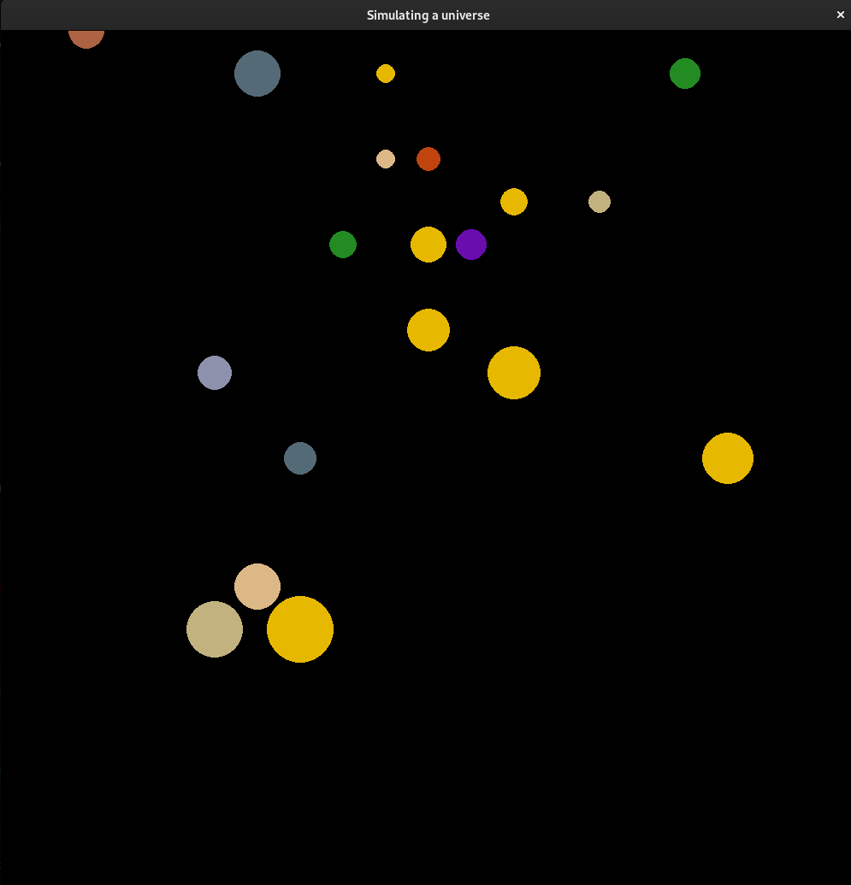
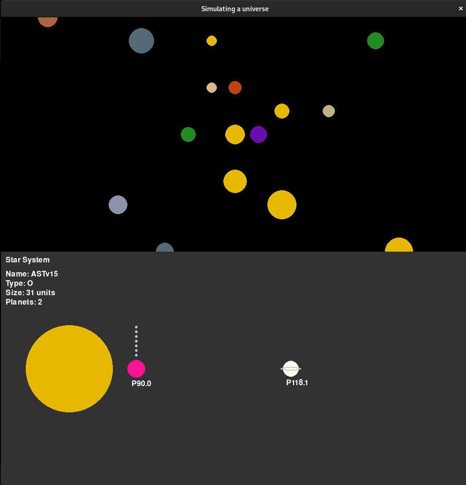
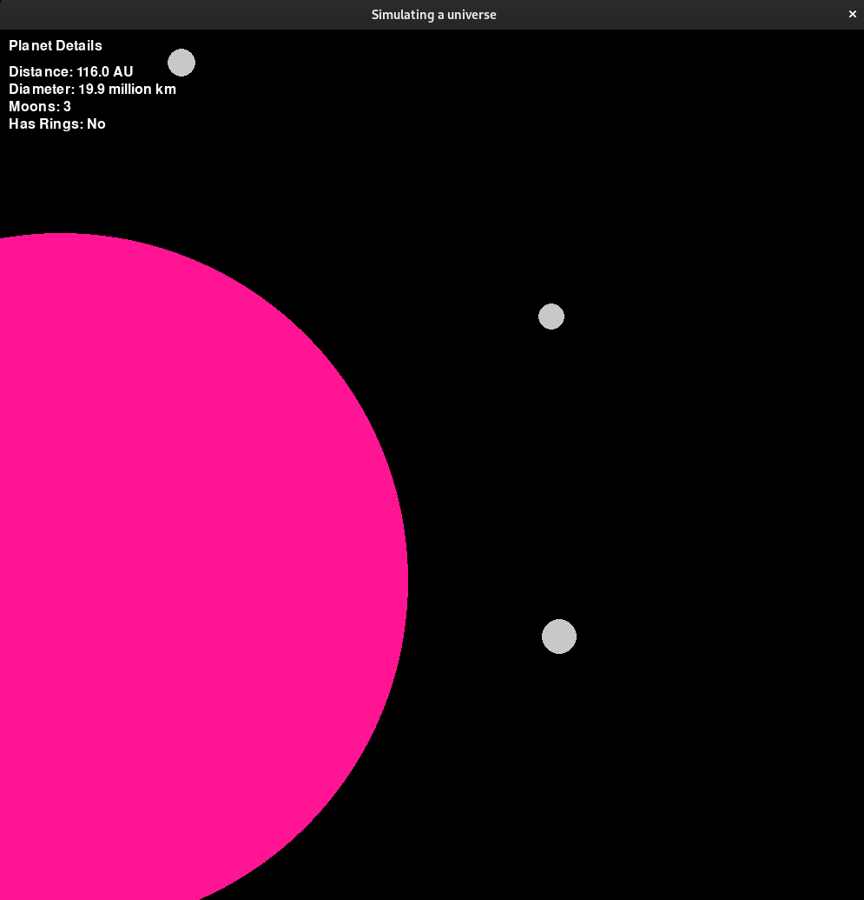

# universe
## Overview

The `universe` project is a simulation of a universe using Python and Pygame. It includes the generation of star systems, planets, and their properties.

## Files

- **main.py**: The main entry point of the application. It initializes Pygame, sets up the screen, and handles the main game loop.
- **lehmer32.py**: Contains the implementation of the Lehmer random number generator.
- **starSystem.py**: Defines the `starSystem` and `Planet` classes, which are used to generate and manage star systems and planets.
- **planetScreen.py**: Currently empty, intended for future development.

## Usage

To run the simulation, execute the `main.py` file:

```sh
python main.py
```

## Dependencies

- Python 3.x
- Pygame

Install the dependencies using pip:

```sh
pip install pygame
```

## Features

- **Star System Generation**: Randomly generates star systems with various properties such as type, size, and color.
- **Planet Generation**: Each star system can have multiple planets with unique properties like distance from the star, diameter, and presence of rings.
- **Interactive Visualization**: Use arrow keys to navigate the galaxy and click on stars to view detailed information about their planets.

## Screenshots

    
    
    
    

## License

This project is licensed under the MIT License.